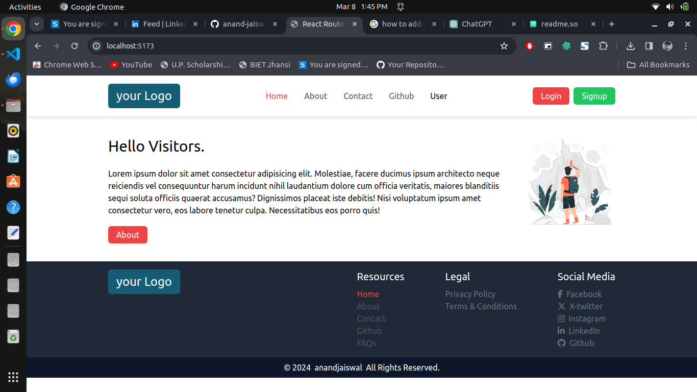
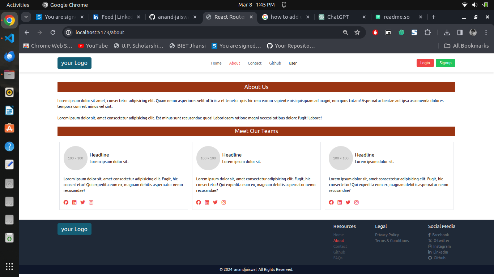

# Simple React Website with React Router

This is a small project for a simple website built using React and React Router. The website consists of navigation, footer, and main components. It includes sections for About, Contact, and Users. Additionally, it utilizes the GitHub API to collect data from GitHub and present it on the website.

## Screenshot



## Features

- Navigation bar to navigate between different sections of the website.
- Footer section providing additional information or links.
- Main components including About, Contact, and Users sections.
- Integration with the GitHub API to display data from GitHub.
- Custom ERROR page such as 404 Not Found.

## Getting Started

To get started with this project, follow these steps:

1. Clone the repository:

```bash
git clone https://github.com/your-username/simple-react-website.git
```

2. Navigate to the project directory:

```bash
cd simple-react-website
```
3. Install dependencies:

```bash
npm install
```

4. Start the development server:

```bash
npm start
```

5. Open your browser and visit http://localhost:3000 to view the website.

## Usage

- Use the navigation bar to switch between different sections such as About, Contact, and Users.
- Explore the Users section to view data retrieved from the users object using custom URLs.
- Go to Github section to explore my github profile build using GitHub API.

## Technologies Used

- Vite
- React
- React Router
- GitHub API
- Tailwind

## Folder Structure

```
simple-react-website/
│
├── public/
│   ├── img/
│   └── ...
│
├── src/
│   ├── components/
│   │   ├── Header/Header.jsx
│   │   ├── Footer/Footer.jsx
│   │   ├── About/About.jsx
│   │   ├── Contact/Contact.jsx
│   │   ├── User/Users.jsx
│   │   └── ...
│   ├── main.jsx
│   └── index.js
|   
│
├── .gitignore
├── package.json
├── README.md
└── ...

```
## Contributing
Contributions are welcome! Feel free to open an issue or submit a pull request.

## Thanks
Thankyou to watch this repository. Feel free to explore more projects. Your support are required me push myself. ❤️
